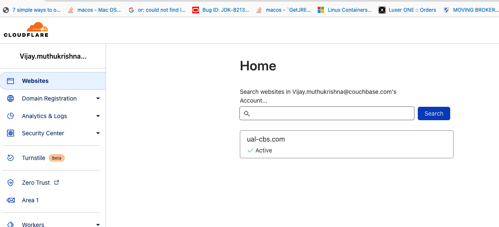

# Autonomous-Operator-EKS

### Pre-requisites

1. Setup EKS Cluster on AWS with the right set of permissions so that EKS can procure resources on AWS

2. Make sure the Kubectl version from the machine you are executing is compatible with EKS Kubernetes version. Version mismatch could result in unforeseen behavior.

3. If the setup requires External DNS then please register a domain with one of the DNS providers (Route53, CloudFlare, GoDaddy etc..)

4. To setup external DNS, make sure that you use the YAML config specific to the Provider. Each one is different.&nbsp;

5. Follow a single method while setting up and making changes to EKS cluster. Do not mix and match.

6. Make sure the EC2 instance type you select for EKS cluster can support the workload.

7. Best practice is to make sure that each pod is on a separate EC2 instance. This is controlled by the affinity setting in the cluster.yaml file.

8. Make sure you install eksctl. This is a separate utility from awscli.

### Installation steps

**1. EKS Cluster setup**

Setup EKS cluster by executing the below command by changing the number of cpus and memory setting. By default the cluster will be managed EKS cluster and will use managed linux nodes. Switch the node type based on your requirements.

    $ eksctl create cluster --name cluster-name --region region-code --instance-selector-vcpus=2 --instance-selector-memory=4 --nodegroup-name nodegroupName --nodes <<number of nodes>> --node-type m5.4xlarge

The kubernetes name space created for this setup is called as " **ual-cbs-ao**". You can choose any name you want for the namespace but make sure that its set as your default namespace while you execute the commands or else for every kubectl command the name space value needs to be passed.

**2**. **Setup an External DNS**

Setup an external DNS account with any of the providers (Cloudflare or GoDaddy etc..) and create a domain. Note that the below instructions correspond to Cloudflare.&nbsp;

Before we setup the TLS certificate we need to determine which domain to use. For this installation we can consider that to be&nbsp; **ual-cbs.com.&nbsp;** If you are planning to setup multiple clusters under this domain then we need to create the cluster under a subdomain. For this installation we can consider that as&nbsp; **cbualdemo.&nbsp;** This subdomain will be part of dns entries while setting up the certificate. The cluster that will be created will be under the subdomain&nbsp; **cbualdemo.ual-cbs.com**

**3. Create TLS Certificates**

Couchbase Operator ensures that the connection to Couchbase cluster is secure and on that end if it detects that the cluster is exposed over public internet it will enforce TLS Encryption

To setup certificates lets clone the directory from Open VPN

    git clone https://github.com/OpenVPN/easy-rsa

Next step is to navigate to the directory and initialize and create the CA certificate and the key.

    cd easy-rsa/easyrsa3./easyrsa init-pki./easyrsa build-ca

During the certificate creation process you will be prompted for a private key password and CA common name (CN).&nbsp; You can by pass the password creation by hitting the return key and for CA common name you could provide UALCB CA or any name that you see fit.

Next step is to setup the DNS entries. Please refer the format for the DNS entries as described in the [documentation](https://docs.couchbase.com/operator/current/tutorial-tls.html#creating-a-couchbase-cluster-server-certificate). For this setup I had used the below entries -&nbsp;

DNS:\*.ual-cbs,DNS:\*.ual-cbs.ual-cbs-ao,DNS:\*.ual-cbs.ual-cbs-ao.svc,DNS:\*.ual-cbs.ual-cbs-ao.svc.cluster.local,DNS:ual-cbs-srv,DNS:ual-cbs-srv.ual-cbs-ao,DNS:ual-cbs-srv.ual-cbs-ao.svc,DNS:\*.ual-cbs-srv.ual-cbs-ao.svc.cluster.local,DNS:localhost,DNS:\*.cbualdemo.ual-cbs.com

As you can see the last entry has the subdomain **cbualdemo.ual-cbs.com**. That's the domain name you have to use to access couchbase cluster. Make sure that there are no typos or spelling mistakes while making these dns entries. If you encounter any issues in the later stages with DNS entries then you will end up recreating the certificates.

**4. Create the Couchbase cluster certificate** &nbsp;

    ./easyrsa --subject-alt-name="DNS:*.ual-cbs,DNS:*.ual-cbs.ual-cbs-ao,DNS:*.ual-cbs.ual-cbs-ao.svc,DNS:*.ual-cbs.ual-cbs-ao.svc.cluster.local,DNS:ual-cbs-srv,DNS:ual-cbs-srv.ual-cbs-ao,DNS:ual-cbs-srv.ual-cbs-ao.svc,DNS:*.ual-cbs-srv.ual-cbs-ao.svc.cluster.local,DNS:localhost,DNS:*.cbualdemo.ual-cbs.com" build-server-full couchbase-server nopass

Note that password protected keys are not supported by Couchbase server or operator.

Once the above command executes successfully you can see in the terminal where the key/certificate pair is located. Usually it will be under following directories -&nbsp;

    pki/private/couchbase-server.key

    pki/issued/couchbase-server.crt

**5.**  **Private Key formatting**

Keys in Couchbase need to be in **PKCS#1** format

Just to make our life easy while formatting the keys and certificate let's copy them to the same directory

    $ cp easy-rsa/easyrsa3/pki/private/couchbase-server.key pkey.key$ cp easy-rsa/easyrsa3/pki/issued/couchbase-server.crt chain.pem$ cp easy-rsa/easyrsa3/pki/ca.crt ca.crt

Now that we have copied the keys let's format them using openssl as shown below -

    openssl rsa -in pkey.key -out pkey.key.der -outform DER

    openssl rsa -in pkey.key.der -inform DER -out pkey.key -outform PEM

Next step is to create Couchbase cluster secret

**6.**  **Configure TLS**

a. Creating server Secret -&nbsp;

Server secrets need to be mounted as a volume within the Couchbase server pod with specific names. The certificate chian must be named as **chain.pem** and the private key as **pkey.key**.

    kubectl create secret generic couchbase-server-tls -n ual-cbs-ao --from-file tls/chain.pem --from-file tls/pkey.key

b. Creating Operator Secret -&nbsp;

    kubectl create secret generic couchbase-operator-tls -n ual-cbs-ao --from-file tls/ca.crt

**7.** &nbsp; **Installing the Operator** &nbsp;

Before creating the Couchbase cluster secret we need to download and install the operator

You can download the operator from downloads page (https://www.couchbase.com/downloads/?family=open-source-kubernetes)

Unzip the binaries and navigate to the unzipped folder. From there execute the below command to install the custom resource definition

    kubectl create -f crd.yaml

Next navigate to bin folder and execute the below command&nbsp;

    cbopcfg generate admission > cbo-admission-config.yaml

The above command will generate an output which will be saved in&nbsp; **cbo-admission-config.yaml&nbsp;** file.

Make sure you are in your namespace, which in this setup is&nbsp; **ual-cbs-ao&nbsp;** and execute the below command

    kubectl apply cbo-admission-config.yaml -n ual-cbs-ao

Then install the operator by using the following command -&nbsp;

    bin/cao create admission --namespace default

    bin/cao create operator --namespace ual-cbs-ao

The admission controller can be installed in the default namespace and the operator can be installed in the custom namespace.

Run the below command to verify whether the operator has been created or not -&nbsp;

    kubectl get deployments

**8. Deploying External DNS&nbsp;**

In this setup I had used **cloudflare-manifest.yaml** which creates the external-dns account, cluster-role, cluster-role binding and then deploys the external-dns&nbsp; by executing the below command.&nbsp;

Please update the&nbsp; **CF\_API\_KEY ,**  **CF\_API\_EMAIL** attributes in&nbsp; **cloudflare-manifest.yaml&nbsp;** &nbsp;to point to your api key and email before executing the command.

    kubectl create cloudflare-manifest.yaml --namespace ual-cbs-ao

Once external-dns is successfully deployed please execute the below command to verify it the pod has been created.

    kubectl get deployments -n ual-cbs-ao

You can also follow the logs to see if there are any error messages -

    kubectl logs -f external-dns-<<your-external-dns-pod-name>> -n ual-cbs-ao

**9. Deploy Couchbase Cluster**

Before deploying the cluster lets create the secret for admin credentials to login into Couchbase server.

    kubectl create -f couchbase_secrets.yaml -n ual-cbs-ao

Next let's create the storage class that needs to be used with Couchbase cluster

    kubectl apply -f storage_classes/storage_classes.yaml

Once storage classes has been created please login into AWS console-\>navigate to EKS clusters-\> Select your cluster-\> Click on Add-ons-\>Add&nbsp; **[Amazon EBS CSI Driver](https://us-east-2.console.aws.amazon.com/eks/home?region=us-east-2#/clusters/ual-eks-cbs/add-ons/aws-ebs-csi-driver)&nbsp;**

Make sure you select&nbsp; [**AmazonEBSCSIDriverPolicy**](https://us-east-1.console.aws.amazon.com/iam/home#/policies/arn:aws:iam::aws:policy/service-role/AmazonEBSCSIDriverPolicy)&nbsp;while creating the add-on. Missing this step will cause issues while provisioning EBS volumes.

Now let's deploy Couchbase cluster

    kubectl create -f ual-cbs-cluster.yaml -n ual-cbs-ao

Wait for few minutes and execute the below command to see if the pods are getting created.

    kubectl get pods -n ual-cbs-ao

Once pods are created and successfully up and running, please login into dns provider account and see whether the dns entries are getting created or not. If its not getting created then login into operator pod and check&nbsp; logs for error messages to troubleshoot.

**10. Deploy Couchbase Sync Gateway**

Before deploying sync gateway please create sync gateway user and grant access for the respective bucket.

Create sync gateway config file and set the srv record of your domain as value for couchbase _server_&nbsp;attribute.

First lets create a secret containing sync gateway config file -&nbsp;

     kubectl create secret generic sgw-config --from-file sgw-config.json

Next lets deploy sync-gateway.

    kubectl create -f sgw-deployment.yaml

This will deploy sync gateway.

## Config files

All files used in setting up the cluster is located under config-files folder.
